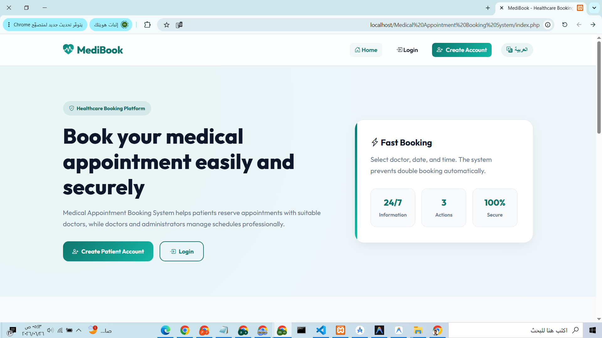
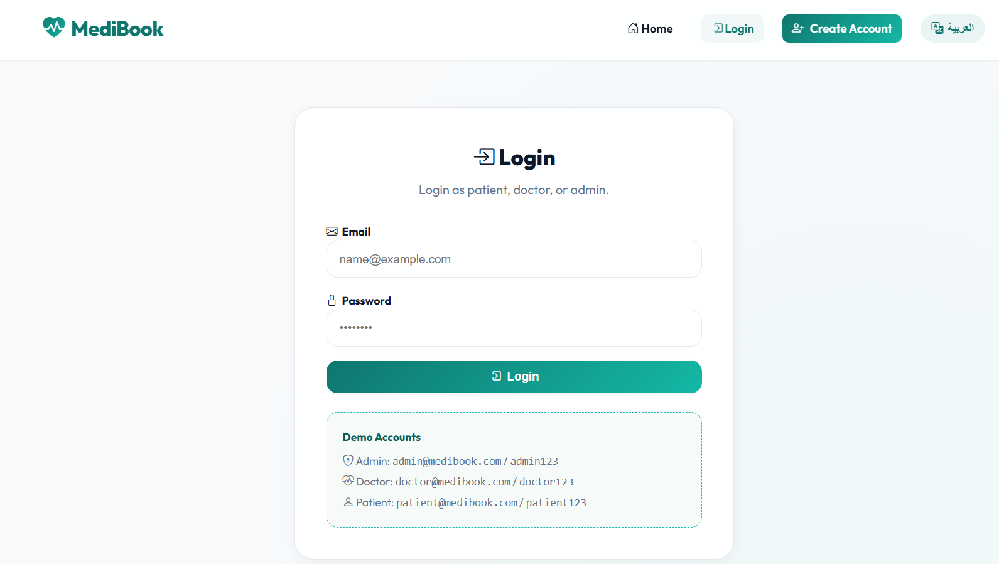
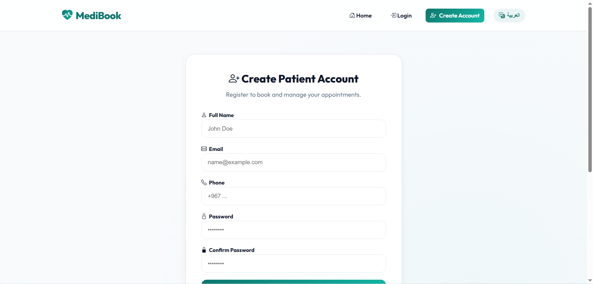
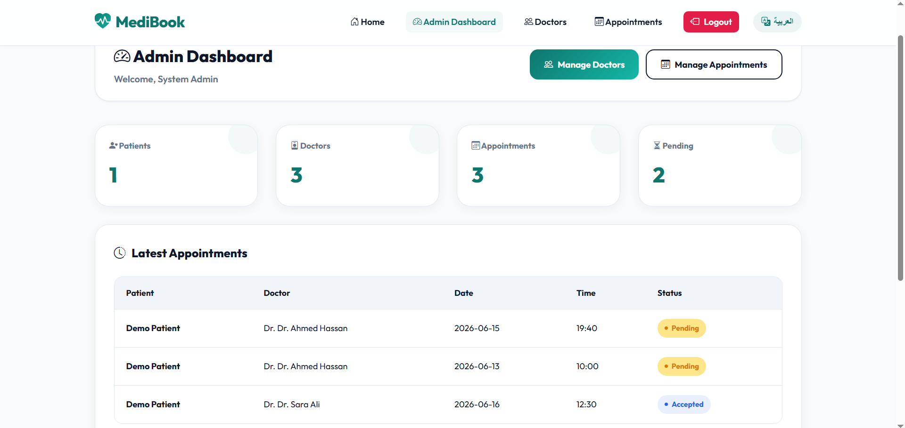
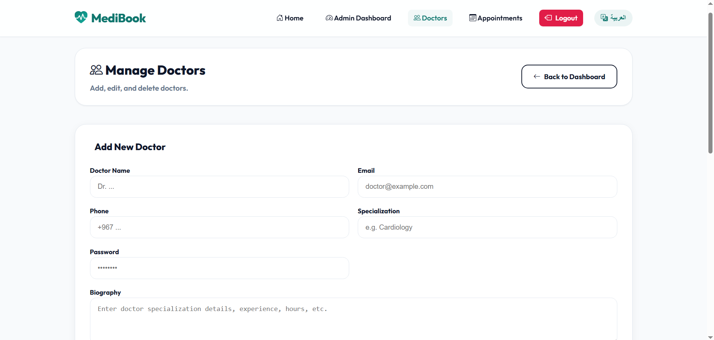
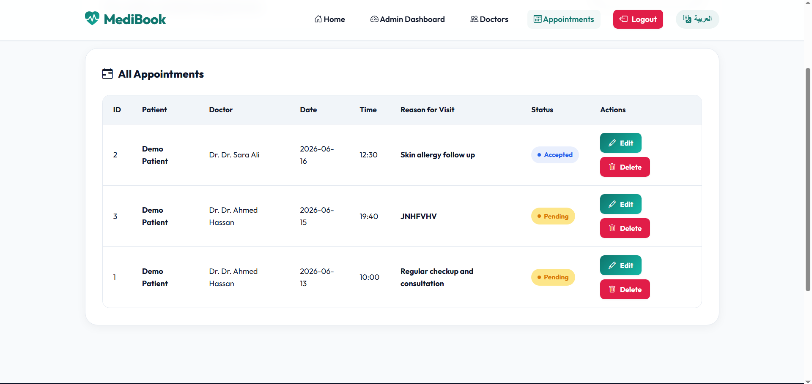

# MediBook - Medical Appointment Booking System

MediBook is a PHP and MySQL medical appointment booking system designed to help patients book appointments easily and securely while allowing administrators to manage doctors, appointments, and system data through a clean dashboard.

The system includes a modern healthcare interface, patient registration, login functionality, admin dashboard, doctors management, and appointments management.

---

## 🌐 Project Overview

MediBook provides a simple and professional platform for medical appointment booking.  
Patients can create an account, log in, and book appointments with doctors.  
Administrators can manage doctors, review appointments, update appointment statuses, and monitor system activity through an admin dashboard.

The interface is designed with a clean healthcare style using soft colors, clear navigation, and responsive layouts.

---

## 🚀 Features

- Modern healthcare booking interface
- Patient account registration
- Login system for patient, doctor, and admin roles
- Admin dashboard
- Doctors management
- Appointments management
- Appointment status tracking
- Arabic language support button
- Responsive and clean UI design
- PHP and MySQL backend
- Built for XAMPP local environment

---

## 🛠️ Technologies Used

- HTML5
- CSS3
- JavaScript
- PHP
- MySQL
- XAMPP
- phpMyAdmin
- Git
- GitHub

---

## 📸 Screenshots

### Home Page

### Login Page

### Register Page

### Admin Dashboard

### Manage Doctors

### Appointments Management

medibook-medical-appointment-system/
│
├── index.php
├── login.php
├── register.php
├── dashboard.php
├── doctors.php
├── appointments.php
├── logout.php
│
├── assets/
│   ├── css/
│   ├── js/
│   └── images/
│
├── database.sql
├── README.md
└── LICENSE
